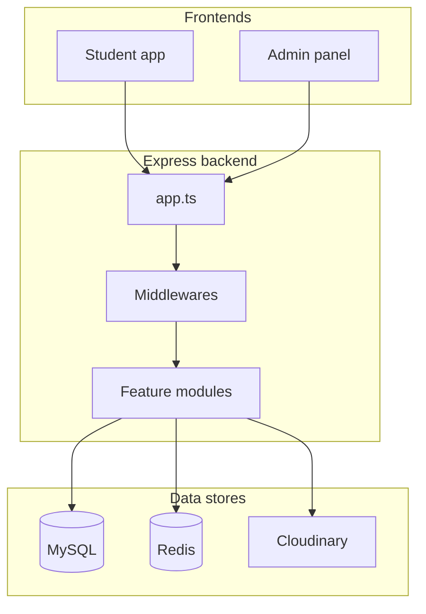

# Architecture

## High-level diagram



## Application entry

| File | Role |
|------|------|
| `src/index.ts` | Starts HTTP server, graceful shutdown, closes Redis |
| `src/app.ts` | Express app: CORS, parsers, route mounting, global error handler |
| `src/Constants.ts` | Shared env-backed constants |

Routes are mounted under `/api/<module>`:

```53:59:backend/src/app.ts
app.use("/api/auth", authRouter);
app.use("/api/profile", profileRouter);
app.use("/api/dining", diningRouter);
app.use("/api/admission", admissionRouter);
app.use("/api/inventory", inventoryRouter);
app.use("/api/finance", financeRouter);
app.use("/api/notifications", notificationsRouter);
```

`app.set("trust proxy", 1)` is enabled so `req.ip` and registration rate limiting work behind Nginx / Next.js rewrites.

## MVC per module

Each feature under `src/modules/<name>/`:

| File | Responsibility |
|------|----------------|
| `*.routes.ts` | HTTP methods, path, middleware chain |
| `*.controller.ts` | Request handling, business rules, Drizzle queries |
| `*.service.ts` | Shared helpers (e.g. session cookies in auth) |
| `*.validators.ts` | Zod schemas (`body`, `params`, `query`, …) |

## Shared infrastructure

```
src/
├── db/
│   ├── index.ts              # drizzle(DATABASE_URL)
│   ├── seed.ts
│   └── models/               # Table definitions
├── lib/
│   ├── redis.ts              # Singleton Redis client
│   ├── sessionStore.ts       # Live sessions
│   └── cache.ts              # Short-TTL cache keys
├── middlewares/
│   ├── auth.middleware.ts
│   ├── validateRequest.middleware.ts
│   ├── errorHandling.middleware.ts
│   └── multer.middleware.ts
├── types/
│   ├── enums.ts              # Domain constants (also used in Zod)
│   └── express.d.ts          # req.user, req.authAccount, …
└── utils/
    ├── ApiError.ts
    ├── ApiResponse.ts
    ├── helpers.ts
    ├── cloudinary.ts
    ├── email.ts
    └── receiptTemplate.ts
```

## Middleware order (global)

1. `cors` — allowed origins from `STUDENT_URL`, `ADMIN_URL`, localhost defaults; `credentials: true`
2. `express.json` / `urlencoded` — 16kb limit
3. `express.static("public")`
4. `cookieParser`
5. `morgan("dev")`
6. Route handlers
7. `handleError` — catches thrown errors (including async from Express 5)

## Per-route middleware (typical)

```text
authenticateToken → authorizeRoles("ROLE", …) → validateRequest(schema) → controller
```

Public routes omit `authenticateToken`. Some auth routes use an in-memory registration rate limiter (5 attempts / 15 minutes per IP).

## Express 5 async errors

Controllers are plain `async` functions. Throw `ApiError` for expected failures; Express forwards them to `handleError`. No `asyncHandler` wrapper.

## Module dependencies

```text
halls + rooms (seeded) ─┬─ admission (seat apply / allocate)
                        ├─ dining (hall-scoped menus)
                        ├─ inventory (rooms, damage)
                        └─ finance (dues, expenses)

auth (uni_students, hall_admins) ── all protected modules
```

## Related docs

- [Authentication](./authentication.md)
- [Database](./database.md)
- [Conventions](./conventions.md)
